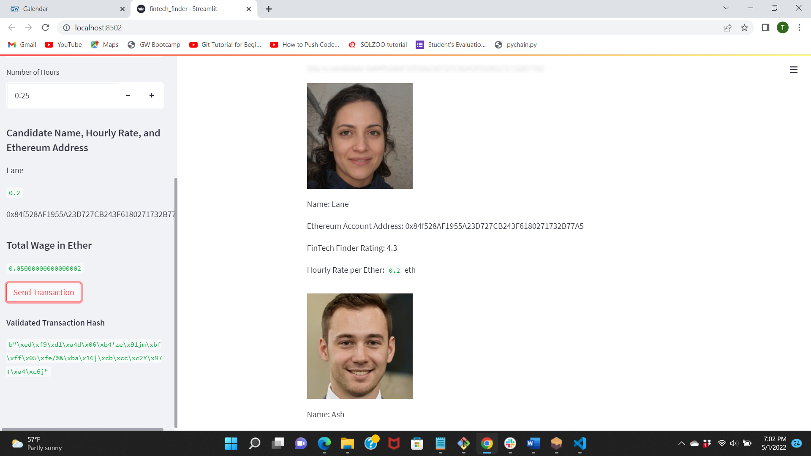

**Project Title Blockchain Wallet**

Fintech Finder is an application that its customers can use to find fintech professionals from among a list of candidates, hire them, and pay them. 

**Technologies**

The code is written in Python 3.7.
The Blockchain is avaliable on Streamlit.
Wallet tested on ganache 

**Installation Guide**

*Fintech Finder.py*

from threading import activeCount

import streamlit as st

from dataclasses import dataclass

from typing import Any, List

from web3 import Web3

w3 = Web3(Web3.HTTPProvider('HTTP://127.0.0.1:7545'))

*Crypto Wallet.py*

import os

import requests

from dotenv import load_dotenv

load_dotenv("Wallet.env")

from bip44 import Wallet

from web3 import Account

from web3 import middleware

from web3.gas_strategies.time_based import medium_gas_price_strategy

**1: Import Ethereum Transaction Functions into the Fintech Finder Application**

Imported from generate_account, get_balance, send_transaction  Crypto Wallet: line 82 

**2. Sign and Execute a Payment Transaction**

Added  code that will calculate a fintech professional’s wage, in ether, based on the worker’s hourly rate and the number of hours that they work for a customer. line 241 

Added code that uses the calculated wage value to send a transaction that pays the worker. line 265

**3. Inspect the Transaction**

**Contributors**

In addtion to me the GW Bootcamp TA, LA, and tutors help me create this project

**License**

The Source code is for educational purposes only and should not be used to make any professional recomendations. Feel free to use for any educational needs